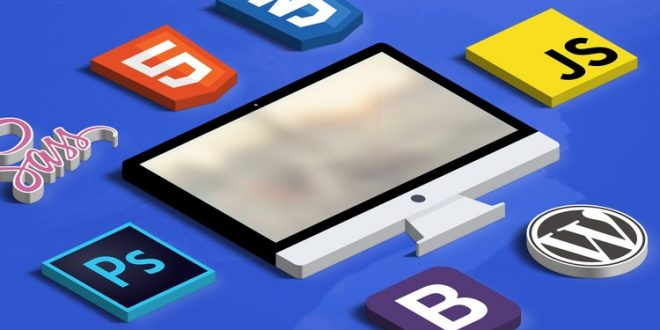

# __Diseño Web Profesional El Curso Completo, Práctico y desde 0__

### HTML5, CSS3, Responsive Design, Adobe XD, SASS, JavaScript, jQuery, Bootstrap 4, WordPress, Git, GitHub.

## __Aprenderás:__  

* A trabajar con Adobe XD para crear bocetos con los que podrás darle forma a tus propias ideas.   

* A crear diseñar página web profesional desde cero con HTML y CSS.   

* A convertir tú sitio web en un sitio adaptable a dispositivos móviles. (Responsive design).   

* A programar en JavaScript uno de los lenguajes de programación más importantes.   

* A manipular tus sitios web para agregarles animaciones y efectos con CSS y jQuery.   

* A trabajar con Bootstrap para crear sitios web responsive en muy poco tiempo.   

* A trabajar con WordPress para administrar tus propios sitios web.   

* A crear un blog de WordPress con un diseño personalizado que haremos.   

* A compartir tu código en Internet mediante Git y GitHub.   

* A subir tu propia página web a Internet para que todo el mundo pueda acceder a ella.   

* HTML, CSS, Responsive Design, Photoshop, SASS, JavaScript, jQuery, Bootstrap, WordPress, Creación de Temas de WordPress, Git, GitHub, Alojamiento en Internet.   

* Y mucho más.

## __¿Para quién es este curso?__
* Personas Interesadas en poder diseñar sitios web profesionales
* Emprendedores que quieren realizar el sitio de su negocio o empresa
* Estudiantes y personas que quieran iniciar una carrera de Diseño Web

[ __*LINK DEL CURSO*__ ](https://click.linksynergy.com/deeplink?id=6UwcVYPRIUM&mid=39197&murl=https%3A%2F%2Fwww.udemy.com%2Fcourse%2Fdiseno-web%2F)
***
[ __*IR AL CURSO*__ ](https://click.linksynergy.com/deeplink?id=6UwcVYPRIUM&mid=39197&murl=https%3A%2F%2Fwww.udemy.com%2Fcourse%2Fdiseno-web%2F)
***
